# 🏦 SQL Final Project

## Project Overview
This project is my SQL final project. The dataset contains tables related to banking:
- `customers`
- `accounts`
- `credits`
- `transactions`                                          
Goal: Analyze customer behavior, account activity, and financial performance using SQL.
## **Tasks / Questions**
### **I. Customer & Account Analysis**
1. Count of active accounts and total balance per customer  
2. Average balance and number of transactions by cities  
3. Account count and balance by customer age group  
4. Top 10 richest customers (by total balance)  
5. Comparison of balances between active and closed accounts  
### **II. Transaction Analysis**
1. Total deposits and withdrawals per account  
2. Total number of transactions and total amount per customer  
3. Accounts with the highest number of transactions  
4. Share of transaction types (Deposit, Withdrawal, Transfer)  
5. Each customer’s largest transaction and comparison with their average transaction amount  
### **III. Time & Trend Analysis**
1. Number and amount of transactions by month and year  
2. Monthly trend of deposits vs withdrawals  
3. Each customer’s largest transaction and its date  
4. Customer segmentation by balance and transaction count (High, Medium, Low)  
5. Credit-to-account balance ratio per customer  
### **IV. Credit Analysis**
1. Credits per customer and total credit amount  
2. Share of credits by status (Active, Closed, Defaulted)  
3. Average monthly credit payment per customer  
4. Profitability analysis by credit interest rates  
5. Ratio of risky credits by region/city  
6. First and last credit amount per customer  
### **I. Customer & Account Analysis**
## Task 1:Count of active accounts and total balance per customer
### [script; (Scripts/Task_1.sql)](Scripts/Task_1.sql)
### result:

  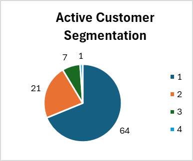
  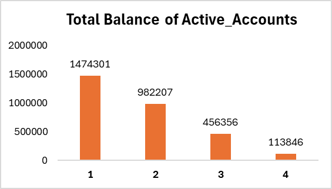

**Analysis Result:**                                      
Customers with only 1 account form the core customer base of the bank, both in terms of number and total balance.
## Task 2: Average balance and number of transactions by cities
### [script; (Scripts/Task_2.sql)](Scripts/Task_2.sql)
### result:
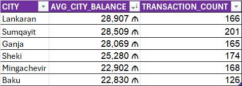

**Analysis Result:**  
Sumqayit is the leader in customer activity and balance. Ganja and Lankaran maintain high balances, Sheki and Mingachevir excel in transaction activity, whereas Baku shows lower metrics in both aspects.
## Task 3: Account count and balance by customer age group
### [script; (Scripts/Task_3.sql)](Scripts/Task_3.sql)
### result:
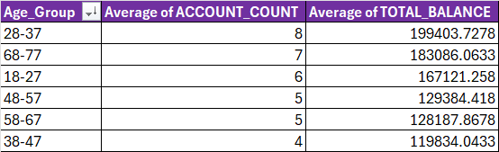

**Analysis Result:**      
Age groups 28-37 and 68-77 are above the average;   
Age groups 38-47 and 58-67 are below the average; 
## Task 4:Top 10 richest customers (by total balance)
### [script; (Scripts/Task_4.sql)](Scripts/Task_4.sql)
### result:
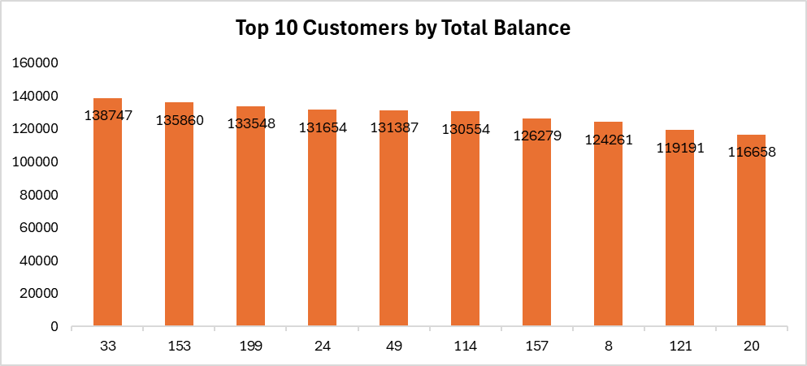
## Task 5: Comparison of balances between active and closed accounts
### [script; (Scripts/Task_5.sql)](Scripts/Task_5.sql)
### result:

  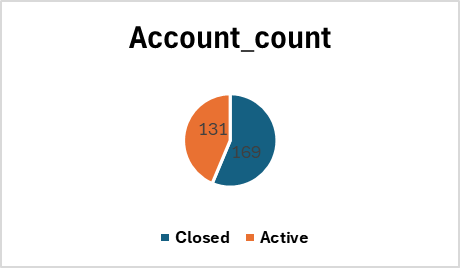
  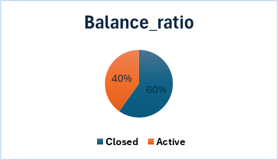

**AnalysisResult:**                                      
Approximately 60% of the total balance belongs to closed accounts. This indicates that a portion of previously high-balance customers are no longer active. The bank has lost higher-balance customers, which signals a customer retention issue.

## **Results & Recommendations:**  
1. Customers with 1 account
   - Offer extra products: deposit accounts, credit cards, investment products, insurance.
   - Goal: increase number of accounts.
2. Regional & premium strategy
   - Sumqayit: Special loyalty & premium service programs; test new products/campaigns here first.
   - Baku: Boost activity with cashback, bonuses, or commission-free transactions.
3. Age group strategy
   - 18-27: Starter accounts, educational products.
   - 28-37: High potential; special offers, investment products, premium services.
   - 38-47: Low balances/accounts; use promotions and loyalty programs.
4. Exclusive benefits
   - Personal manager, discounted fees, extra interest.
   - Offer additional products: investment products, insurance, premium cards.
5. Customer retention strategy
   - Investigate reasons for account closures (fees, interest, satisfaction).
   - Apply loyalty/bonus programs for active customers.
   - Re-engage high-balance closed-account customers with “return bonuses.”
### **II. Transaction Analysis**
## Task 6: Total deposits and withdrawals per account
### [script; (Scripts/Task_6.sql)](Scripts/Task_6.sql)
### result:
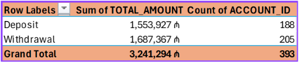

**AnalysisResult:**  
Total transaction amount: 3.24 million ₼;   
Deposit: 1.55 million ₼, 188 accounts;  
Withdrawal: 1.68 million ₼, 205 accounts;
## Task 7: Total number of transactions and total amount per customer  
### [script; (Scripts/Task_7.sql)](Scripts/Task_7.sql)
### result:
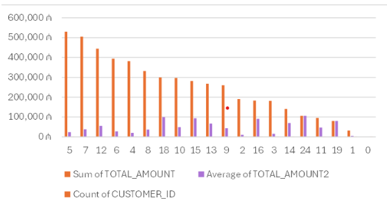

**AnalysisResult:**  
Highest amount: in the range of 5–8 transactions   
High-transaction customers (10+):few but valuable        
Low-transaction customers (1–3): many but low-value
## Task 8: Accounts with the highest number of  transactions  
### [script; (Scripts/Task_8.sql)](Scripts/Task_8.sql)
### result:
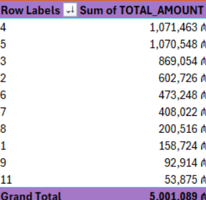     

**AnalysisResult:**    
Accounts with 4–5 transactions: Highest amount (~1M ₼)    
3 transactions: Balanced turnover      
1–2 transactions: Passive group, low amount       
6+ transactions: Few accounts, each transaction low amount   
11 transactions → many transactions, but low amount 
## Task 9: AShare of transaction types (Deposit, Withdrawal, Transfer)  
### [script; (Scripts/Task_9.sql)](Scripts/Task_9.sql)
### result:
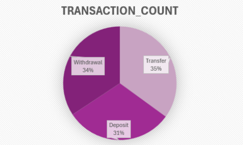     

**AnalysisResult:**        
ansfers slightly lead over Withdrawals and Deposits.     
Transfer: 35%; Withdrawal: 34.3%; Deposit: 30.7%
## Task 10: Each customer’s largest transaction and comparison with their average transaction amount  
### [script; (Scripts/Task_10.sql)](Scripts/Task_10.sql)
### result:
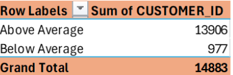     

**AnalysisResult:**   
About 94% have their largest transaction above the average transaction amount.
## **Results & Recommendations:**  
6. Increase deposits
   - Offer bonuses, campaigns, and interest incentives.
7. Medium-active customers (5–8 transactions)
   - Retain with loyalty programs and rewards.
8. Low-active customers (1–3 transactions)
   - Boost activity with promotions, cashback, and incentives.
9. Premium customers (10+ transactions)
   - Provide personalized service, special discounts, and encourage higher transaction amounts.
10. Improve channels
    - Simplify mobile and online transactions.
### **III. Time & Trend Analysis**
## Task 11: Number and amount of transactions by month and year 
### [script; (Scripts/Task_11.sql)](Scripts/Task_11.sql)
### result:

  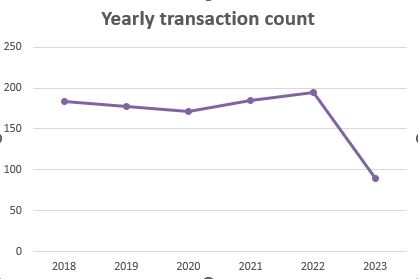
  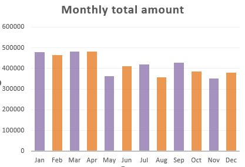

  

## Task 12: Number and amount of transactions by month and year                                                  
### [script; (Scripts/Task_12.sql)](Scripts/Task_12.sql) 
### result:                       
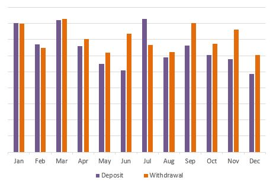  
## Task 13: Each customer’s largest transaction and its date                              
### [script; (Scripts/Task_13.sql)](Scripts/Task_13.sql) 
### result:                       
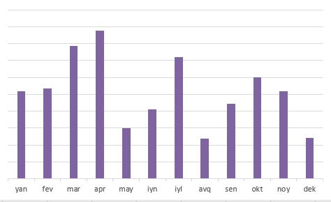  
## Task 14:Customer segmentation by balance and transaction count (High, Medium, Low)                
### [script; (Scripts/Task_14.sql)](Scripts/Task_14.sql) 
### result:                       
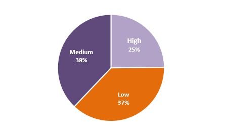  

**AnalysisResult:**   
High: Balance > average, accounts > 8;  
Medium: Balance > average, accounts  5–8;  
Low: Balance < average, accounts  < 5;
## Task 15:Credit to account balance ratio for each customer            
### [script; (Scripts/Task_15.sql)](Scripts/Task_15.sql) 
### result:                       
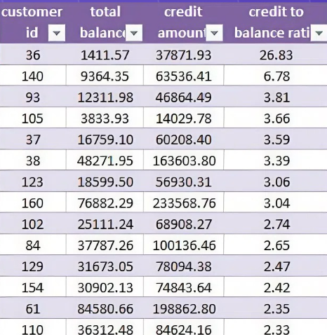  

**AnalysisResult:**    
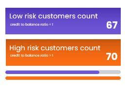
## **Results & Recommendations:** 
1.Seasonal campaigns aligned with seasonal factors.  
2.Loyalty programs to boost deposits.   
3.Plan resources & liquidity before peak periods.  
4.Low/Medium: Simple products & digital offers.   
5.High: Personalized advice, premium services, extra loyalty.  
6.Strengthen risk monitoring & support high-risk customers.
### **IV. Credit Analysis**
## Task 16:Credits per customer and total credit amount 
### [script; (Scripts/Task_16.sql)](Scripts/Task_16.sql) 
### result:                       
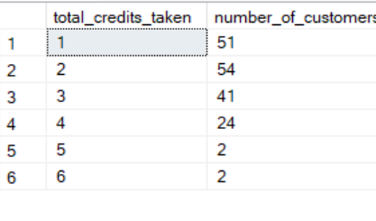  
## Task 17:Share of credits by status (Active, Closed, Defaulted) 
### [script; (Scripts/Task_17.sql)](Scripts/Task_17.sql) 
### result:                       
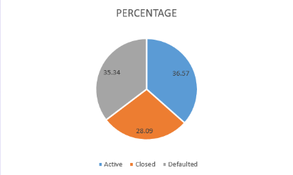  
## Task 18: Average monthly loan payment per customer
## [script; (Scripts/Task_18.sql)](Scripts/Task_18.sql) 
### result:                       
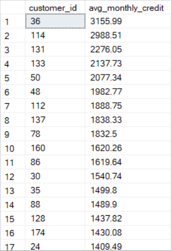 
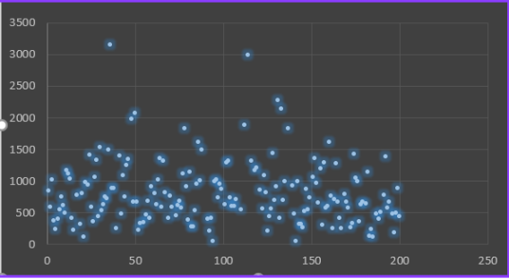 
## Task 19: Profitability analysis based on loan interest rates
## [script; (Scripts/Task_19.sql)](Scripts/Task_19.sql) 
### result:                       
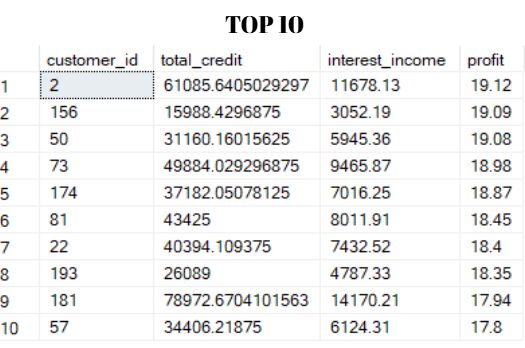 
## Task 20:The ratio of risky loans by region/city
## [script; (Scripts/Task_20.sql)](Scripts/Task_20.sql) 
### result:                       
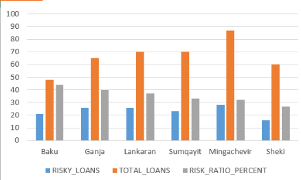 

**AnalysisResult:**  
Baku has the highest loan risk ratio (43.8%);   
followed by Ganja (40%); 
Sheki shows the lowest risk level (26.7%);          
other cities remain in the 32–37% range.
## Task 21:The first and last loan amounts taken by each customer.
## [script; (Scripts/Task_21.sql)](Scripts/Task_21.sql) 
### result:                       
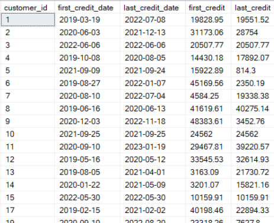 
## **Results & Recommendations:**  
1.Exit surveys for customer satistafction   
2.Lower interest rates   
3.Build Loyalty Programs   
4.Launch online loan applications via mobile/web.

 
 
 
 