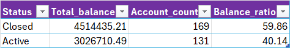

# 🏦 Bank SQL Final Project

## Project Overview
This project is my SQL final project. The dataset contains tables related to banking:

- `customers`
- `accounts`
- `credits`
- `transactions`

Goal: Analyze customer behavior, account activity, and financial performance using SQL.

## **Tasks / Questions**

### **I. Customer & Account Analysis**
1. Count of active accounts and total balance per customer  
2. Average balance and number of transactions by cities  
3. Account count and balance by customer age group  
4. Top 10 richest customers (by total balance)  
5. Comparison of balances between active and closed accounts  

### **II. Transaction Analysis**
1. Total deposits and withdrawals per account  
2. Total number of transactions and total amount per customer  
3. Accounts with the highest number of transactions  
4. Share of transaction types (Deposit, Withdrawal, Transfer)  
5. Each customer’s largest transaction and comparison with their average transaction amount  

### **III. Time & Trend Analysis**
1. Number and amount of transactions by month and year  
2. Monthly trend of deposits vs withdrawals  
3. Each customer’s largest transaction and its date  
4. Customer segmentation by balance and transaction count (High, Medium, Low)  
5. Credit-to-account balance ratio per customer  

### **IV. Credit Analysis**
1. Credits per customer and total credit amount  
2. Share of credits by status (Active, Closed, Defaulted)  
3. Average monthly credit payment per customer  
4. Profitability analysis by credit interest rates  
5. Ratio of risky credits by region/city  
6. First and last credit amount per customer  

## Task 1:Count of active accounts and total balance per customer
### script; ### [script; (Scripts/Task_1.sql)](Scripts/Task_1.sql)
### result:

  
  

## Task 2: Average balance and number of transactions by cities
### script; (Scripts/Task_2.sql)
### result:

## Task 3: Account count and balance by customer age group
### script; (Scripts/Task_3.sql)
### result:

## Task 4:Top 10 richest customers (by total balance)
### script; (Scripts/Task_4.sql)
### result:

## Task 5: Comparison of balances between active and closed accounts
### script; (Scripts/Task_5.sql)
### result:

